```mermaid
erDiagram
    PROFILES ||--o{ FARMS : owns
    PROFILES ||--o{ FARM_MEMBERS : has
    FARMS ||--o{ FARM_MEMBERS : contains
    FARMS ||--o{ ANIMALS : has
    FARMS ||--o{ ANIMAL_GROUPS : has
    FARMS ||--o{ ANIMAL_EVENTS : logs
    FARMS ||--o{ WEIGHINGS : records
    FARMS ||--o{ VACCINATIONS : records
    FARMS ||--o{ TREATMENTS : records
    FARMS ||--o{ INSEMINATIONS : records
    FARMS ||--o{ PREGNANCIES : records
    FARMS ||--o{ MILK_RECORDS : records
    FARMS ||--o{ MILK_DELIVERIES : records
    FARMS ||--o{ FEED_ITEMS : has
    FARMS ||--o{ FEED_LOGS : records
    FARMS ||--o{ BUYERS : has
    FARMS ||--o{ SUPPLIERS : has
    FARMS ||--o{ SALES : has
    FARMS ||--o{ CERTIFICATIONS : has
    FARMS ||--o{ DOCUMENTS : stores
    FARMS ||--o{ BLOCKCHAIN_RECORDS : anchors
    FARMS ||--o{ TRACEABILITY_TOKENS : issues
    FARMS ||--o{ AUDIT_LOG : logs
    FARMS ||--o{ ALERTS : generates

    ANIMALS ||--o{ ANIMAL_GROUP_MEMBERS : joins
    ANIMALS ||--o{ ANIMAL_EVENTS : experiences
    ANIMALS ||--o{ WEIGHINGS : has
    ANIMALS ||--o{ VACCINATIONS : receives
    ANIMALS ||--o{ TREATMENTS : receives
    ANIMALS ||--o{ INSEMINATIONS : participates
    ANIMALS ||--o{ PREGNANCIES : experiences
    ANIMALS ||--o{ MILK_RECORDS : produces
    ANIMALS ||--o{ FEED_LOGS : consumes
    ANIMALS ||--o{ SALE_ITEMS : sold_in
    ANIMALS ||--o{ CERTIFICATIONS : has
    ANIMALS ||--o{ ALERTS : generates
    ANIMALS ||--o{ TRACEABILITY_TOKENS : has

    ANIMALS ||--o{ ANIMALS : parentage
    BREEDS ||--o{ ANIMALS : categorizes

    ANIMAL_GROUPS ||--o{ ANIMAL_GROUP_MEMBERS : contains
    ANIMAL_GROUPS ||--o{ FEED_LOGS : receives_feed

    VACCINES_CATALOG ||--o{ VACCINATIONS : describes
    TREATMENTS_CATALOG ||--o{ TREATMENTS : describes
    DISEASES_CATALOG ||--o{ TREATMENTS : treats
    FEED_ITEMS ||--o{ FEED_LOGS : consumed

    INSEMINATIONS ||--o{ PREGNANCIES : results_in
    ANIMAL_EVENTS ||--o{ PREGNANCIES : records_as

    MILK_RECORDS ||--o{ ANIMALS : from

    BUYERS ||--o{ MILK_DELIVERIES : receives
    BUYERS ||--o{ SALES : purchases

    SALES ||--o{ SALE_ITEMS : contains
    SALE_ITEMS ||--o{ ANIMALS : references

    CERTIFICATIONS ||--o{ TRACEABILITY_TOKENS : links

    PROFILES ||--o{ ANIMAL_EVENTS : records
    PROFILES ||--o{ WEIGHINGS : records
    PROFILES ||--o{ VACCINATIONS : applies
    PROFILES ||--o{ TREATMENTS : prescribes
    PROFILES ||--o{ INSEMINATIONS : performs
    PROFILES ||--o{ MILK_RECORDS : records
    PROFILES ||--o{ FEED_LOGS : records
    PROFILES ||--o{ DOCUMENTS : uploads
    PROFILES ||--o{ BLOCKCHAIN_RECORDS : anchors
    PROFILES ||--o{ SALES : creates
    PROFILES ||--o{ AUDIT_LOG : performs
    PROFILES ||--o{ PUSH_SUBSCRIPTIONS : subscribes

    PROFILES ||--o{ SIGNATURES : signs

    PUSH_SUBSCRIPTIONS ||--o{ ALERTS : receives

    BLOCKCHAIN_RECORDS ||--o{ SIGNATURES : from

    TRACEABILITY_TOKENS ||--o{ ANIMALS : "animal or sale"

    AUDIT_LOG ||--o{ PROFILES : "by user"

    ALERTS ||--o{ ANIMALS : "about animal"

    PROFILES {
        uuid id PK
        text privy_did UK
        citext email UK
        text full_name
        text wallet_address
        text phone
        text avatar_url
        timestamptz created_at
        timestamptz updated_at
    }

    FARMS {
        uuid id PK
        text name
        text legal_id
        text country
        text region
        text address
        jsonb location
        text logo_url
        uuid owner_profile_id FK
        timestamptz created_at
        timestamptz updated_at
    }

    FARM_MEMBERS {
        uuid farm_id FK "PK"
        uuid profile_id FK "PK"
        farm_role role
        timestamptz created_at
    }

    ANIMALS {
        uuid id PK
        uuid farm_id FK
        text tag UK
        text name
        uuid breed_id FK
        animal_sex sex
        animal_purpose purpose
        date birth_date
        numeric birth_weight_kg
        numeric current_weight_kg
        text color
        uuid mother_id FK
        uuid father_id FK
        text origin
        animal_status status
        date acquired_at
        date removed_at
        text photo_url
        jsonb metadata
        timestamptz created_at
        timestamptz updated_at
    }

    BREEDS {
        uuid id PK
        text name UK
        text species
        animal_purpose purpose
    }

    ANIMAL_GROUPS {
        uuid id PK
        uuid farm_id FK
        text name UK
        text kind
        text notes
        timestamptz created_at
    }

    ANIMAL_GROUP_MEMBERS {
        uuid group_id FK "PK"
        uuid animal_id FK "PK"
        timestamptz joined_at
        timestamptz left_at
    }

    ANIMAL_EVENTS {
        uuid id PK
        uuid farm_id FK
        uuid animal_id FK
        event_type type
        timestamptz occurred_at
        uuid performed_by FK
        jsonb payload
        text notes
        timestamptz created_at
    }

    WEIGHINGS {
        uuid id PK
        uuid animal_id FK
        uuid farm_id FK
        numeric weight_kg
        timestamptz measured_at
        uuid measured_by FK
        text notes
    }

    VACCINATIONS {
        uuid id PK
        uuid animal_id FK
        uuid farm_id FK
        uuid vaccine_id FK
        timestamptz applied_at
        numeric dose_ml
        text batch_number
        uuid applied_by FK
        date next_due_at
        text notes
    }

    VACCINES_CATALOG {
        uuid id PK
        text name UK
        text manufacturer
        text disease
        numeric dose_ml
        text route
        integer booster_days
        integer withdrawal_days
        text notes
    }

    TREATMENTS {
        uuid id PK
        uuid animal_id FK
        uuid farm_id FK
        uuid treatment_id FK
        uuid disease_id FK
        timestamptz started_at
        timestamptz ended_at
        text dose
        uuid prescribed_by FK
        date withdrawal_until_meat
        date withdrawal_until_milk
        text notes
    }

    TREATMENTS_CATALOG {
        uuid id PK
        text name UK
        text active_ingredient
        text kind
        text dose
        text route
        integer withdrawal_meat_days
        integer withdrawal_milk_days
        numeric dose_per_kg
        text notes
    }

    DISEASES_CATALOG {
        uuid id PK
        text name UK
        text icd
    }

    INSEMINATIONS {
        uuid id PK
        uuid animal_id FK
        uuid farm_id FK
        uuid sire_id FK
        text sire_external
        text method
        timestamptz performed_at
        uuid performed_by FK
        text notes
    }

    PREGNANCIES {
        uuid id PK
        uuid animal_id FK
        uuid farm_id FK
        uuid insemination_id FK
        date confirmed_at
        date expected_due_at
        text result
        uuid calving_event_id FK
        text notes
    }

    MILK_RECORDS {
        uuid id PK
        uuid farm_id FK
        uuid animal_id FK
        date recorded_on
        milk_shift shift
        numeric liters
        numeric fat_pct
        numeric protein_pct
        integer scc
        numeric temperature_c
        uuid recorded_by FK
        text notes
        timestamptz created_at
    }

    MILK_DELIVERIES {
        uuid id PK
        uuid farm_id FK
        uuid buyer_id FK
        timestamptz delivered_at
        numeric liters
        numeric price_per_liter
        text currency
        text invoice_number
        text notes
    }

    FEED_ITEMS {
        uuid id PK
        uuid farm_id FK
        text name UK
        text kind
        text unit
    }

    FEED_LOGS {
        uuid id PK
        uuid farm_id FK
        uuid animal_id FK
        uuid group_id FK
        uuid feed_id FK
        numeric quantity
        timestamptz fed_at
        uuid recorded_by FK
    }

    BUYERS {
        uuid id PK
        uuid farm_id FK
        text name
        text legal_id
        text contact
        citext email
        text phone
        text address
        text notes
        timestamptz created_at
    }

    SUPPLIERS {
        uuid id PK
        uuid farm_id FK
        text name
        text kind
        text contact
        citext email
        text phone
        text notes
    }

    SALES {
        uuid id PK
        uuid farm_id FK
        uuid buyer_id FK
        sale_status status
        timestamptz sold_at
        numeric total_amount
        text currency
        text payment_method
        text invoice_number
        text notes
        uuid created_by FK
        timestamptz created_at
        timestamptz updated_at
    }

    SALE_ITEMS {
        uuid id PK
        uuid sale_id FK
        uuid animal_id FK
        text description
        numeric quantity
        numeric unit_price
        numeric weight_kg
        numeric subtotal
    }

    CERTIFICATIONS {
        uuid id PK
        uuid farm_id FK
        uuid animal_id FK
        cert_type type
        text issuer
        date issued_at
        date valid_until
        text document_url
        jsonb metadata
        timestamptz created_at
    }

    DOCUMENTS {
        uuid id PK
        uuid farm_id FK
        text entity_type
        uuid entity_id
        text storage_path
        text filename
        text mime_type
        bigint size_bytes
        uuid uploaded_by FK
        timestamptz created_at
    }

    BLOCKCHAIN_RECORDS {
        uuid id PK
        uuid farm_id FK
        text entity_type
        uuid entity_id
        chain_network network
        text contract_address
        text tx_hash UK
        bigint block_number
        text payload_hash
        timestamptz anchored_at
        uuid created_by FK
    }

    TRACEABILITY_TOKENS {
        uuid id PK
        uuid farm_id FK
        text entity_type
        uuid entity_id
        text slug UK
        boolean is_active
        timestamptz deactivated_at
        text deactivation_reason
        timestamptz created_at
    }

    AUDIT_LOG {
        bigint id PK
        uuid farm_id FK
        uuid profile_id FK
        text action
        text entity
        uuid entity_id
        jsonb diff
        timestamptz at
    }

    ALERTS {
        uuid id PK
        uuid farm_id FK
        uuid animal_id FK
        text type
        date due_at
        text status
        jsonb payload
        timestamptz notified_at
        timestamptz created_at
    }

    SIGNATURES {
        uuid id PK
        text entity_type
        uuid entity_id
        uuid profile_id FK
        text signer_address
        text signature
        text payload_hash
        timestamptz signed_at
    }

    PUSH_SUBSCRIPTIONS {
        uuid id PK
        uuid profile_id FK
        text endpoint UK
        text p256dh
        text auth
        text user_agent
        timestamptz created_at
    }
```

**Para visualizar este diagrama:**

1. **Online**: Copia el contenido Mermaid a [mermaid.live](https://mermaid.live)
2. **VS Code**: Instala extensión "Markdown Preview Mermaid Support"
3. **GitHub**: Visualízalo directamente en el repositorio
